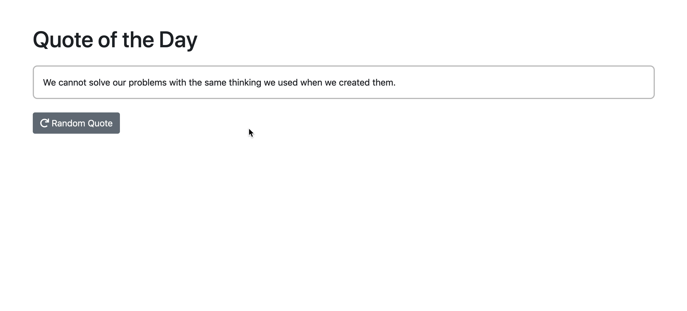

# Zitat des Tages

Erstelle eine App für zufällige Zitate, die ein zufälliges Zitat anzeigt, sobald der Nutzer die App(seite) lädt oder auf die Schaltfläche "Zufälliges Zitat abrufen" klickt.

1.  Erstelle eine Funktion, die ein zufälliges Zitat aus einem Array von
    Zitaten aus dem Array `js/index.js` zurückgibt. Denke daran, dass es eine nette Funktion für
    Zufallszahlen in der MDN-Dokumentation für `Math.random()` gibt.

**Hinweis:** _Manchmal_ ist es eine gute Idee, mehrere Funktionen zu erstellen, die jeweils nur einen bestimmten Zweck erfüllen, um den Code lesbarer und
und einfacher zu wartbar/erweiterbar zu machen.

2.  Füge eine Schaltfläche 'Random Quote' als `button` oder `input`-Element unter dem Zitat-Element ein. Wenn die Schaltfläche angeklickt wird, sollte ein neues Zitat gezeigt werden.

3.  **Optional:** Style nach deinem Geschmack und lade/verwende Bootstrap über CDN.

> Tipp: In der folgenden Abbildung siehst du, wie dein Ergebnis aussehen sollte.

